# Workflow `analyze-content-pair`

```mermaid
flowchart TD
    A[DEFAULT_CRITERIA.xlsx] --> B[Python PREPARE]
    B --> C[Đọc toàn bộ criteria<br/>theo thứ tự trong workbook]
    C --> D[Tạo criteria_payload]

    D --> E[LLM ANALYSIS]
    F[Content A] --> E
    G[Content B] --> E

    E --> H[Lần lượt xử lý từng criterion]
    H --> I[Đọc criterion và requirement<br/>để xác định khía cạnh cần quan sát]
    I --> J{Criterion có áp dụng<br/>cho dataset?}

    J -->|Không| R[Đặt result là chuỗi rỗng]
    J -->|Có| K[Phân tích criterion trên<br/>toàn bộ cặp Aᵢ → Bᵢ]

    K --> L[Xác định nội dung được:<br/>giữ nguyên · giữ ý nhưng biến đổi<br/>loại bỏ · bổ sung · sắp xếp lại]
    L --> M[So sánh các cặp để tìm:<br/>pattern lặp · tỷ lệ · thứ tự<br/>điều kiện áp dụng · mức biến thiên]
    M --> N{Phát hiện có đáng tin cậy<br/>và tái sử dụng được?}

    N -->|Không| R
    N -->|Có| O[Viết result thành<br/>quy luật DNA cô đọng]

    O --> P[Thêm object vào analysis_results]
    R --> P
    P --> Q{Đã phân tích hết<br/>criteria?}
    Q -->|Chưa| H
    Q -->|Rồi| S[analysis_results đầy đủ<br/>một object cho mỗi criterion]

    S --> T[Python FINALIZE]
    T --> U[Validate criterion_key và criterion_id<br/>đủ · đúng · không trùng · không lạ]
    U --> V[Trim Result]
    V --> W{Result có nội dung?}

    W -->|Có| X[Giữ criterion]
    W -->|Rỗng| Y[Loại criterion khỏi output]

    X --> Z[Tạo workbook mới]
    Z --> AA[Giữ thứ tự tương đối<br/>theo DEFAULT_CRITERIA.xlsx]
    AA --> AB[Chỉ ghi 5 cột:<br/>ID · Nhóm · Tiêu chí<br/>Requirement · Result]
    AB --> AC[result_analysis.xlsx]
    AC --> AD[Dữ liệu tinh gọn<br/>cho bước tạo DNA]
```

## Chỉ dẫn áp dụng trong `LLM ANALYSIS`

Với mỗi criterion, LLM thực hiện theo đúng trình tự:

1. Đọc `criterion` và `requirement` để xác định chính xác khía cạnh cần quan sát.
2. Kiểm tra criterion có áp dụng cho dataset hiện tại hay không.
3. Nếu có nhiều cặp `Aᵢ → Bᵢ`, phân tích criterion trên toàn bộ các cặp tương ứng.
4. Với từng cặp, xác định A đã được giữ nguyên, giữ ý nhưng biến đổi, loại bỏ, bổ sung nội dung mới, sắp xếp lại hoặc thay đổi vị trí như thế nào liên quan đến criterion.
5. So sánh các mẫu để tìm pattern lặp lại, tỷ lệ hoặc khoảng tỷ lệ nếu đo được, thứ tự triển khai, điều kiện áp dụng và mức biến thiên.
6. Chỉ giữ những phát hiện có thể dùng lại để biến một Content A mới thành Content B mới theo cùng cách.
7. Viết `result` thành quy luật/DNA cô đọng.
8. Nếu criterion không áp dụng hoặc không rút ra được quy luật đáng tin cậy, trả `result: ""`.

`requirement` là hướng dẫn phân tích, không phải câu hỏi để trả lời máy móc. `result` phải là quy luật tổng hợp từ dữ liệu A ↔ B.

LLM vẫn trả đúng một object cho mỗi criterion. Python chỉ loại criterion khỏi `result_analysis.xlsx` khi `result` rỗng; không cần trạng thái `KEEP/DROP`.
